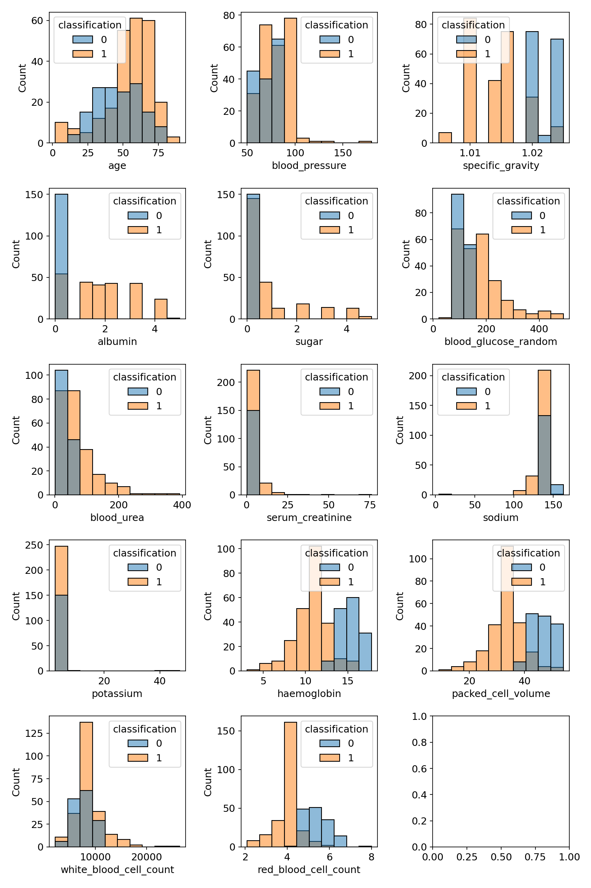
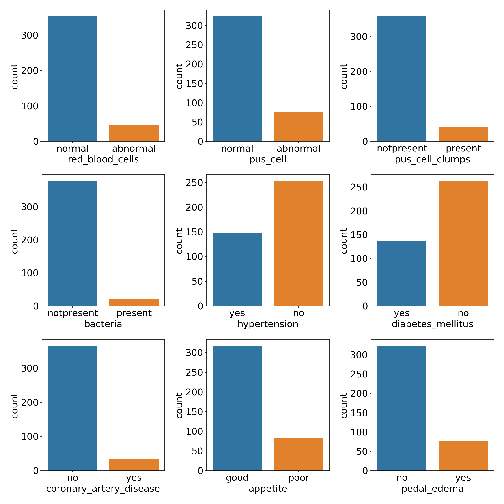
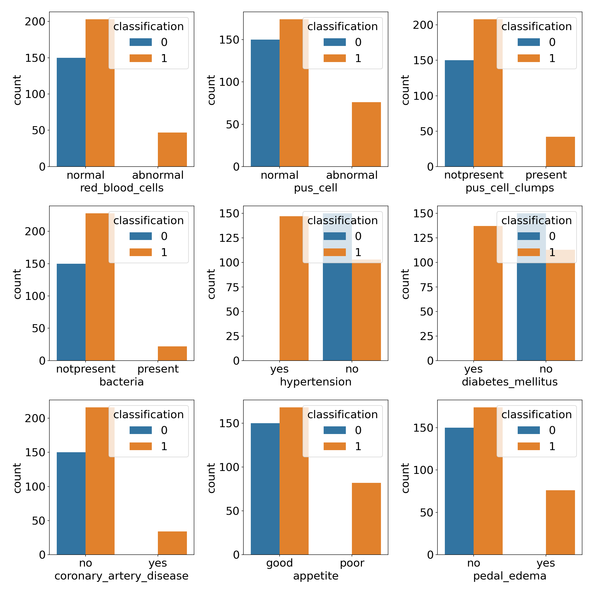
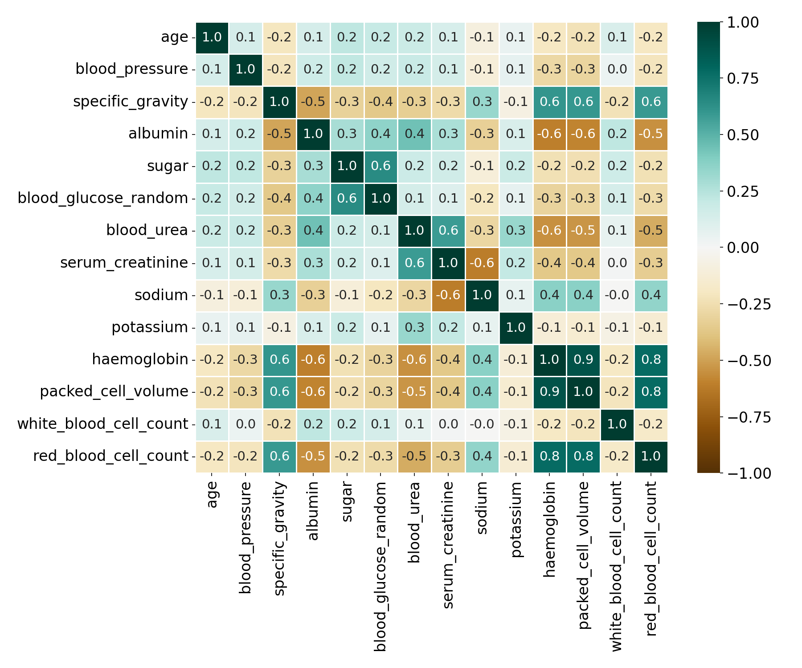
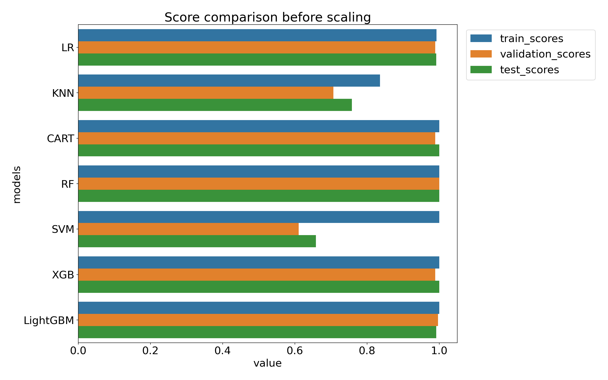
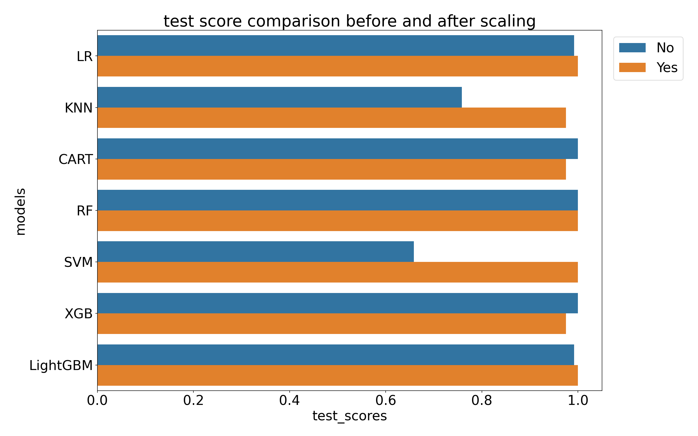
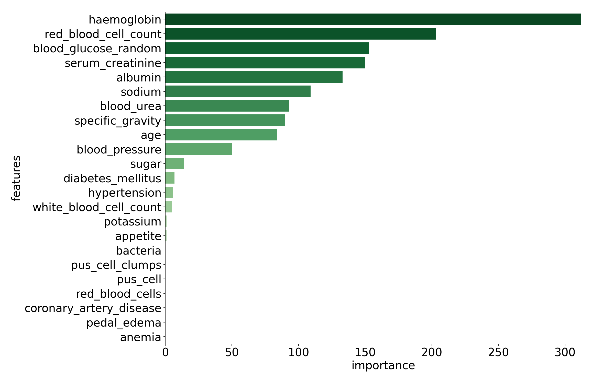

- [Chronic-Kidney-Disease](#chronic-kidney-disease)
- [Data set information](#data-set-information)
  - [Features](#features)
- [Preprocessing](#preprocessing)
  - [Clean categorical data](#clean-categorical-data)
  - [Fill the missing values.](#fill-the-missing-values)
  - [Distribution of features](#distribution-of-features)
    - [Numeric features distribution](#numeric-features-distribution)
    - [Categorical features](#categorical-features)
    - [Categorical features distribution based on classification](#categorical-features-distribution-based-on-classification)
  - [Correlations](#correlations)
  - [Encoding](#encoding)
- [Model creation](#model-creation)
  - [Feature importance](#feature-importance)
    - [LogisticRegression](#logisticregression)
    - [RandomForestClassifier](#randomforestclassifier)
    - [Lightgbm](#lightgbm)
- [Conclusion](#conclusion)

# Chronic-KIdney-Disease
# Data set information
link: https://archive.ics.uci.edu/ml/datasets/Chronic_Kidney_Disease

The data set was collected over two months of period.

<!-- |||
|:--|:--|
| age - age| bp - blood pressure|
|sg - specific gravity|al - albumin|
su - sugar | rbc - red blood cells
pc - pus cell | pcc - pus cell clumps
ba - bacteria | bgr - blood glucose random
bu - blood urea | sc - serum creatinine
sod - sodium | pot - potassium
hemo - hemoglobin | pcv - packed cell volume
wc - white blood cell count | rc - red blood cell count
htn - hypertension | dm - diabetes mellitus
cad - coronary artery disease | appet - appetite
pe - pedal edema | ane - anemia
class - class -->

## Features

Total 24 features are in the dataset out of which 11 are neumeric and 14 are categorical.

Numeric features:

| | |
|:-|:-|
Age | age in years
Blood Pressure | bp in mm/Hg
Blood Glucose Random | bgr in mgs/dl
Blood Urea | bu in mgs/dl
Serum Creatinine| sc in mgs/dl
Sodium | sod in mEq/L
Potassium | pot in mEq/L
Hemoglobin | hemo in gms
Packed Cell Volume
White Blood Cell Count | wc in cells/cumm
Red Blood Cell Count | rc in millions/cmm

 
Categorical features
    
| | |
|:-|:-|
Specific Gravity | sg - (1.005,1.010,1.015,1.020,1.025)
Albumin | al - (0,1,2,3,4,5)
Sugar | su - (0,1,2,3,4,5)
Red Blood Cells | rbc - (normal,abnormal)
Pus Cell  | pc - (normal,abnormal)
Pus Cell clumps | pcc - (present,notpresent)
Bacteria | ba - (present,notpresent)
Hypertension | htn - (yes,no)
Diabetes Mellitus | dm - (yes,no)
Coronary Artery Disease | cad - (yes,no)
Appetite | appet - (good,poor)
Pedal Edema | pe - (yes,no)
Anemia | ane - (yes,no)
Class  | class - (ckd,not ckd)

# Preprocessing
The coloumn names are renamed for better understanding
    
    "bp":"blood_pressure",
    "sg":"specific_gravity",
    "al":"albumin",
    "su":"sugar",
    "rbc":"red_blood_cells",
    "pc":"pus_cell",
    "pcc":"pus_cell_clumps",
    "ba":"bacteria",
    "bgr":"blood_glucose_random",
    "bu":"blood_urea",
    "sc":"serum_creatinine",
    "sod":"sodium",
    "pot":"potassium",
    "hemo":"haemoglobin",
    "pcv":"packed_cell_volume",
    "wc":"white_blood_cell_count",
    "rc":"red_blood_cell_count",
    "htn":"hypertension",
    "dm":"diabetes_mellitus",
    "cad":"coronary_artery_disease",
    "appet":"appetite",
    "pe":"pedal_edema",
    "ane":"anemia"`

Lets check the data type in features:

    #   Column                   Non-Null Count  Dtype  
    ---  ------                   --------------  -----  
    0   id                       400 non-null    int64  
    1   age                      391 non-null    float64
    2   blood_pressure           388 non-null    float64
    3   specific_gravity         353 non-null    float64
    4   albumin                  354 non-null    float64
    5   sugar                    351 non-null    float64
    6   red_blood_cells          248 non-null    object 
    7   pus_cell                 335 non-null    object 
    8   pus_cell_clumps          396 non-null    object 
    9   bacteria                 396 non-null    object 
    10  blood_glucose_random     356 non-null    float64
    11  blood_urea               381 non-null    float64
    12  serum_creatinine         383 non-null    float64
    13  sodium                   313 non-null    float64
    14  potassium                312 non-null    float64
    15  haemoglobin              348 non-null    float64
    16  packed_cell_volume       330 non-null    object 
    17  white_blood_cell_count   295 non-null    object 
    18  red_blood_cell_count     270 non-null    object 
    19  hypertension             398 non-null    object 
    20  diabetes_mellitus        398 non-null    object 
    21  coronary_artery_disease  398 non-null    object 
    22  appetite                 399 non-null    object 
    23  pedal_edema              399 non-null    object 
    24  anemia                   399 non-null    object 
    25  classification           400 non-null    object 
    dtypes: float64(11), int64(1), object(14)

Some numeric features are dtype 'object. Convert these to numeric.

## Clean categorical data
There are some 'tabs' and 'spaces in catergorical values. I removed them.

## Fill the missing values.

There are several ways missing values can be filled.
1. Use **mode** for categorial values and **mean** for numerical values
2. Uuse nearest neighbour to replace the nan values for categorical values.

I have used the first method to fill the missing values.  
In addition, I have separated the values based on outcome ("classificatoin"). Then I calculated the 'mode' or 'mean' of the respective groups.

## Distribution of features

### Numeric features distribution

### Categorical features

### Categorical features distribution based on classification

## Correlations
Correlations between numeric columns

Very strong correlations between 'Haemoglobin', 'packed_cell_volume', and 'red_blood_cell_count'. Lets check the Variance Inflation Factor (VIF).

Features with corresponding VIF values are shown below

    haemoglobin               5.708914
    packed_cell_volume        5.462380
    red_blood_cell_count      2.964857
    serum_creatinine          2.386813
    blood_urea                2.207721
    sodium                    1.971927
    blood_glucose_random      1.923232
    sugar                     1.888911
    specific_gravity          1.875649
    albumin                   1.842837
    potassium                 1.236124
    blood_pressure            1.138054
    white_blood_cell_count    1.130427
    age                       1.111609

By default the threshold for VIF is considered as 5.
Let's remove 'packed_cell_volume'

After removing the 'packed_cell_volume' the VIF values are 

    haemoglobin               3.465580
    red_blood_cell_count      2.784319
    serum_creatinine          2.384181
    blood_urea                2.191799
    sodium                    1.961415
    blood_glucose_random      1.922979
    sugar                     1.887993
    specific_gravity          1.869344
    albumin                   1.838446
    potassium                 1.233370
    blood_pressure            1.125388
    white_blood_cell_count    1.122434
    age                       1.105879

Now all the VIF values are less than 5. We can proceed to next step.

## Encoding

I need to convert the categorical values to numeric values.

Let's check how many unique values each feature has.

    red_blood_cells has unique values 2
    pus_cell has unique values 2
    pus_cell_clumps has unique values 2
    bacteria has unique values 2
    hypertension has unique values 2
    diabetes_mellitus has unique values 2
    coronary_artery_disease has unique values 2
    appetite has unique values 2
    pedal_edema has unique values 2
    anemia has unique values 2

Each one of them has only two values. Hence, I can use LabelEncoder.
The next step is creation of models.

# Model creation

Here I have used seven classification models.

1. LogisticRegression (LR)
2. KNeighborsClassifier (KNN)
3. DecisionTreeClassifier (CART)
4. RandomForestClassifier (RF)
5. SVM (SVM)
6. GradientBoostingClassifier (XGB)
7. LGBMClassifier (LightGBM)

Train_score, validation_score and test_score of the models before scaling the data.

The range of the feature values varies a lot as shown in [histogram](#categorical-features). Hence, it is a standard practice to scale the data between 0 and 1 for better model performance. I scaled the data using skleran RobustScaler. Here is the performance of models before and after scaling the dataset.

From the above comparison it is clear that the performance KNN and SVM improved a lot after scaling data.

## Feature importance

###  LogisticRegression

### RandomForestClassifier

### Lightgbm

# Conclusion

- I have cleaned the data for categorical features. 
- Filled the missing values based on categorical stats.
- Calculated cross validation of 7 machine learning models and compared the validation score with test score.
- Scaling the data improved the performance of KNN and SVM.

Almost all the models give priority to the following features.

    haemoglobin, 
    red_blood_cell_count,  
    serum_creatinine,  
    blood_glucose_random,  
    specific_gravity, 
    albumin
